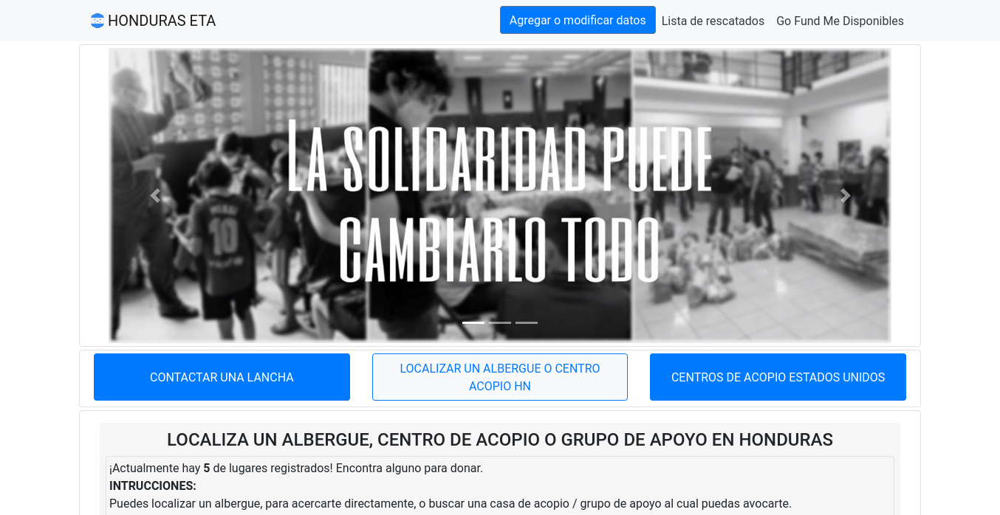

# Web informative platform "Honduras ETA" 🇭🇳 

Honduras ETA was a platform made for centralizing information related to donations, where people could find some places to donate and what they were needing, and where they could also register new places to go to. This was done during the crisis caused by hurricane ETA, in 2020. It was hosted at --honduraseta.com--, however it's currently offline.

But you can still watch a demo with mock data at: https://honduras-eta.herokuapp.com

It was a short duration project, I developed this in a short amount of time, so it probably had a lot of things that could have been improved. However, it achieved the desired goal at a moment of emergency.

- Node Js
- Express
- React Js
- CSS3
- Bootstrap
- HTML5
- Postgresql
